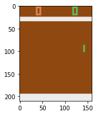

# Лабораторная работа №1

---
Выполнил Филиппенко Илья

## Описание окружения Pong.

Окружение представляет из себя пространство действий (в нашем варианте трехцветное), воссоздающее игру Atari Pong. 
Цель игры - контроллируя правую панель, отразить максимальное количество шаров в сторону оппонента. 
Агент отразивший шар за панель получает очко.  
Присутствует 3 уровня сложности.

## Obseravation space 

Пространство наблюдений отображает экран Atari размером 210х160, присутствуют варианты в черно-белой палитре и непосредственно RAM, мы использовали цветной.

## Action space

В пространстве действий 6 возможных вариантов: NOOP, FIRE, RIGHT, LEFT, RIGHTFIRE, LEFTFIRE. Нас интересуют лишь 3 из них - NOOP, RIGHT, LEFT. 

## Ход работы

Код доступен [по ссылке](RL_lab1.ipynb)

 

 

---
## Вывод
В ходе работы создано окружение Pong. Этому сильно воспрепятствовало лицензирование при установке пакета gym, 
а конкретно пространства ALE. Также создана Deep Q-learning модель с целью обучения в этом пространстве. 
После обучения проведено тестирование, в результате которого стало ясно что модель недообучилась - 
агент уводит свою панель к грани экрана и остается там, в итоге проигрывая. 
Помимо политики многослойного перцептрона рассмотрена политика сверточной сети, отличия в результатах не наблюдается.

В следующих лабораторных работах будет исследован выбор количества эпох и скорости обучения.