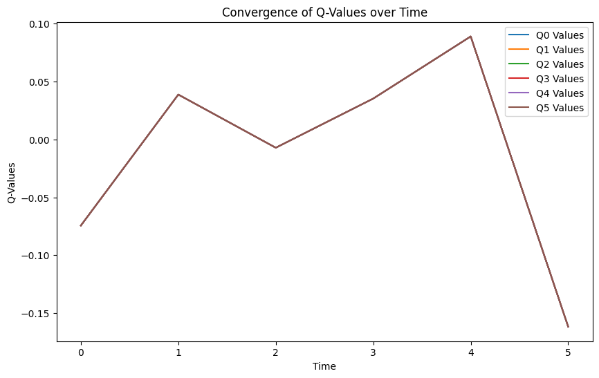
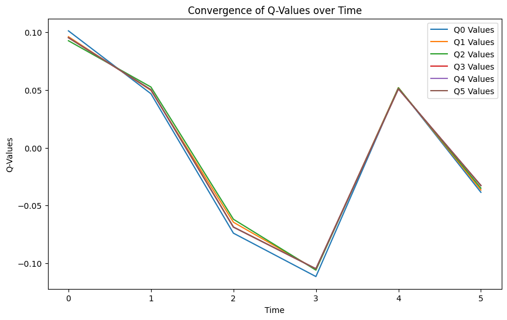

# Лабораторная работа №1

---
Выполнил Филиппенко Илья

### Описание окружения Taxi
Окружение представляет собой поле размером 5 на 5 клеток. На поле присутствуют стены, поэтому движение между некоторыми клетками невозможно. Также присутствует ограждение поля. В 4-х фиксированных местах располагаются цветные клетки, в которых можно принимать и высаживать пассажиров. Ниже представлена схема поля:
```
+---------+
|R: | : :G|
| : | : : |
| : : : : |
| | : | : |
|Y| : |B: |
+---------+
```
При инициализации среды в одну из цветных клеток помещается пассажир, а другая помечается как точка назначения. Задача агента - переместиться к пассажиру, забрать его и доставить к месту назначения.

Терминальное состояние - момент высадки пассажира

### Observation space
- 25 возможных позиций автомобиля
- 5 возможных состояний пассажира (в одной из 4 клеток или в такси)
- 4 возможных пункта назначения

Всего есть 500 комбинаций параметров, из них достижимы 404 (исключаются состояния, когда пассажир изначально появляется в точке назначения).

### Action space
Существует 6 возможных действий
- 0: Переместиться назад
- 1: Переместиться вперед
- 2: Переместиться вправо
- 3: Переместиться влево
- 4: Взять пассажира
- 5: Высадить пассажира

### Система наград
- +20: Пассажир высажен в точке назначения
- -20: Пассажир высажен в неправильной точке или предпринято действие "взять пассажира" там, где пассажира нет
- -1: в случае любой другой ситуации

### Ход работы

Код доступен [по ссылке](RL_lab3.ipynb)

До обучения модели с discount_factor = 0.01, mean_reward:-200.00 +/- 0.00

После обучения модели с discount_factor = 0.01, mean_reward:-200.00 +/- 0.00

Время обучения модели при discount_factor = 0.01 : 0.9222030639648438 секунд.

Сходимость Q-value для Discount factor = 0.01
 
---
До обучения модели с discount_factor = 0.5, mean_reward:-1956.12 +/- 275.39

После обучения модели с discount_factor = 0.5, mean_reward:-1970.37 +/- 225.76

Время обучения модели при discount_factor = 0.5 : 0.9191598892211914 секунд.

Сходимость Q-value для Discount factor = 0.5
 
---
До обучения модели с discount_factor = 0.99, mean_reward:-200.00 +/- 0.00

После обучения модели с discount_factor = 0.99, mean_reward:-200.00 +/- 0.00

Время обучения модели при discount_factor = 0.99 : 0.8885860443115234 секунд.

Сходимость Q-value для Discount factor = 0.99
 
---
### Описание экспериментов
Были проведены несколько экспериментов с разным значением дисконтирующих факторов
и learning rate. Ни одна комбинация параметров не позволила успешно выполнить задачу,
возможно, для данного окружения лучше подходит другой алгоритм.

При learning rate выше 0.001 система ведет себя нестабильно, выбирая неоптимальные действия и сразу приводя
окружение к терминальному состоянию. При значениях ниже система выбирает консервативную стратегию
и не предпринимает действий, которые могут привести к большому отрицательному вознаграждению.

Значения дисконт фактора влияют на степень риска. При больших значениях Discount factor система не повторяет действий, которые приводят к наградам, что значительно снижает обучаемость.